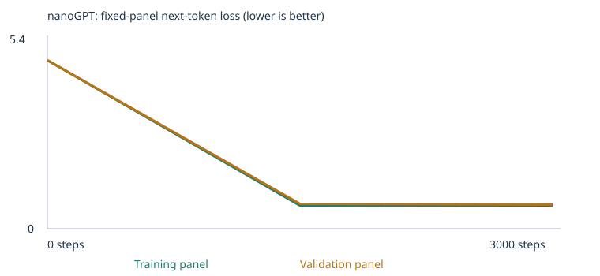
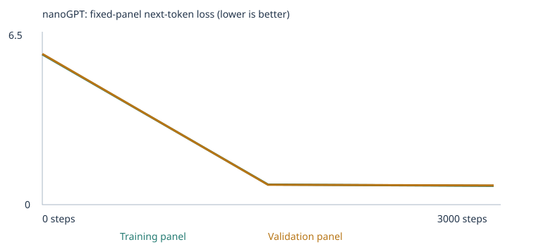
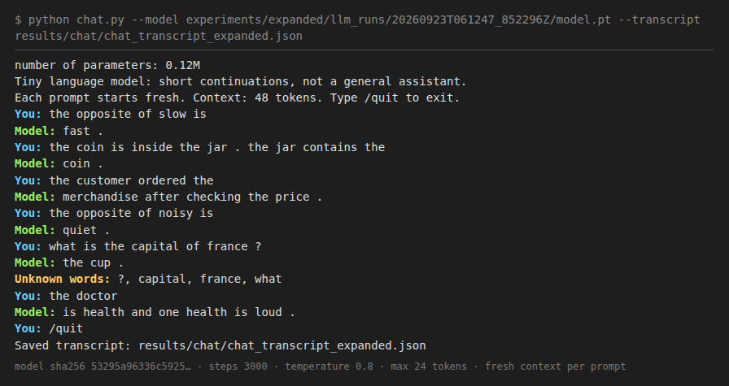

# Class 4: Building a Custom LLM (nanoGPT, word tokens)

**JD Nathanson · Fundamentals of Agentic AI · Berkeley Haas, Fall 2026**

I trained two tiny word-level nanoGPT models from scratch (2 blocks, 4 heads, 64-number embeddings, 48-token context). Both use the same settings; only the corpus changes.

1. **Starter:** the supplied classroom corpus only.
2. **Expanded:** the classroom corpus plus my own teaching files for two extension-eval categories, **opposites** and **spatial relations**.

Both models ran the fixed 48-case language eval suite before and after training. I chat with the expanded model through the supplied terminal interface. This is a tiny model that continues short sentences. It is not a general assistant, and nothing below should be read as "it understands language."

> **Repository layout note:** all project files are in the [`custom-llm-assignment4/`](custom-llm-assignment4/) folder. Every link below points there. Before running any command in §9, `cd custom-llm-assignment4` first.

## Four-row comparison (48 fixed cases)

| Experiment | Stage | Correct / 48 | Scorable / 48 | Accuracy among scorable | Full results |
|---|---|---|---|---|---|
| Starter corpus | Untrained | 9 (18.8%) | 24 | 37.5% | [CSV](custom-llm-assignment4/experiments/starter/llm_runs/20260923T061024_781755Z/language_evals/untrained/eval_results.csv) · [JSON](custom-llm-assignment4/experiments/starter/llm_runs/20260923T061024_781755Z/language_evals/untrained/eval_results.json) · [summary](custom-llm-assignment4/experiments/starter/llm_runs/20260923T061024_781755Z/language_evals/untrained/eval_summary.json) |
| Starter corpus | Trained | **19 (39.6%)** | 24 | 79.2% | [CSV](custom-llm-assignment4/experiments/starter/llm_runs/20260923T061024_781755Z/language_evals/final/eval_results.csv) · [JSON](custom-llm-assignment4/experiments/starter/llm_runs/20260923T061024_781755Z/language_evals/final/eval_results.json) · [summary](custom-llm-assignment4/experiments/starter/llm_runs/20260923T061024_781755Z/language_evals/final/eval_summary.json) |
| Expanded corpus | Untrained | 6 (12.5%) | 29 | 20.7% | [CSV](custom-llm-assignment4/experiments/expanded/llm_runs/20260923T061247_852296Z/language_evals/untrained/eval_results.csv) · [JSON](custom-llm-assignment4/experiments/expanded/llm_runs/20260923T061247_852296Z/language_evals/untrained/eval_results.json) · [summary](custom-llm-assignment4/experiments/expanded/llm_runs/20260923T061247_852296Z/language_evals/untrained/eval_summary.json) |
| Expanded corpus | Trained | **29 (60.4%)** | 29 | 100% | [CSV](custom-llm-assignment4/experiments/expanded/llm_runs/20260923T061247_852296Z/language_evals/final/eval_results.csv) · [JSON](custom-llm-assignment4/experiments/expanded/llm_runs/20260923T061247_852296Z/language_evals/final/eval_results.json) · [summary](custom-llm-assignment4/experiments/expanded/llm_runs/20260923T061247_852296Z/language_evals/final/eval_summary.json) |

**Every case in all four stages, with free continuations:** [results/eval_comparison.md](custom-llm-assignment4/results/eval_comparison.md). The comparison files are [starter](custom-llm-assignment4/experiments/starter/llm_runs/20260923T061024_781755Z/language_eval_comparison.json) and [expanded](custom-llm-assignment4/experiments/expanded/llm_runs/20260923T061247_852296Z/language_eval_comparison.json). These are **public development tests**: I read them to choose my extension categories, so they are not an unseen final benchmark.

## Repository map

| Path | What it is |
|---|---|
| [experiments/starter/custom_llm.ipynb](custom-llm-assignment4/experiments/starter/custom_llm.ipynb) | **Executed** notebook, Experiment 1 (all outputs kept) |
| [experiments/expanded/custom_llm.ipynb](custom-llm-assignment4/experiments/expanded/custom_llm.ipynb) | **Executed** notebook, Experiment 2 (all outputs kept) |
| `experiments/*/llm_runs/<run>/` | Full saved run: config, corpus, manifest, split, vocabulary, tokenization, inspection, history, samples, curves, checkpoint, `model.pt`, `model_untrained.pt`, evals, chat transcript |
| `experiments/*/llm_runs/<run>.zip` | Results ZIP exactly as the notebook produced it |
| [evals/language_evals.json](custom-llm-assignment4/evals/language_evals.json) | The unchanged 48-case suite (SHA-256 `e8affcd7…3e17f7`, the hash the notebook pins) |
| [run_evals.py](custom-llm-assignment4/run_evals.py) · [chat.py](custom-llm-assignment4/chat.py) · [nanogpt_model.py](custom-llm-assignment4/nanogpt_model.py) | Supplied eval runner, terminal chat, and pinned Karpathy nanoGPT source (unchanged) |
| [corpus/](custom-llm-assignment4/corpus/) | My two teaching files: `opposites.txt`, `spatial_relations.txt` |
| [corpus_tools/](custom-llm-assignment4/corpus_tools/) | `make_extension_corpus.py` (generates corpus/), `audit_leakage.py` (my extra leakage check), `summarize_evals.py` (builds the 48-case table) |
| [results/](custom-llm-assignment4/results/) | 48-case comparison, extra leakage audit, eval reruns from saved weights, chat evidence |
| [embedding-viewer.html](custom-llm-assignment4/embedding-viewer.html) | Supplied viewer. Open it locally and load either run's `checkpoint.json` |

---

## 1. My choices and prediction

| Choice | Value | Why |
|---|---|---|
| Corpus | Exp. 1: `classroom` with an empty `corpus/`. Exp. 2: `classroom` + `corpus/opposites.txt` + `corpus/spatial_relations.txt` | Run the baseline first, then change **only** the data |
| Training steps | 3,000 (both) | The suggested main budget: 3,000 × 32 = 96,000 passage examples, so every training passage is seen many times |
| Learning rate | 0.003 (both), 3× the suggested 0.001 | To test whether bigger updates reach low loss faster. Warmup (100 steps) and cosine decay (to 10%) should keep it stable. A rate that's too small barely moves the weights in 3,000 steps. One that's too large overshoots, makes the loss spike, or diverges. |

My predictions were written in each notebook **before** training (the "My prediction" cell under section 1): [starter](custom-llm-assignment4/experiments/starter/custom_llm.ipynb) · [expanded](custom-llm-assignment4/experiments/expanded/custom_llm.ipynb). How they compare with what actually happened:

| I expected | I observed |
|---|---|
| Untrained loss ≈ ln(512) ≈ 6.2 | **Wrong:** 4.93 (starter) and 5.91 (expanded). The starter corpus has only **133 word types**, so the vocabulary was 136, not 512, and ln(136) = 4.91. The expanded vocabulary is 358, and ln(358) = 5.88. An untrained model is close to uniform over its own vocabulary. |
| Starter patterns well above 25% chance; new wording less | Correct: 16/16 starter patterns, 3/8 new wording |
| Extension cases unscorable in the starter | Correct: 0/24 scorable. The starter vocabulary doesn't even contain **`is`** |
| Expanded coverage 24 → 30 | **Close:** 24 → 29. One opposites case is still unscorable because the distractor **`round`** is not in my corpus |
| Spatial 2–3/3, opposites 1–2/3 | Spatial **3/3**; opposites **2/2 scorable** (the third is unscorable) |
| Starter patterns stay ≈16/16 | 16/16. Unexpectedly, **new wording also rose, from 3/8 to 8/8** (see §6) |
| Small train/validation gap | Correct: final train 0.678 vs val 0.706 (starter); 0.740 vs 0.755 (expanded) |

## 2. The runs

| | Experiment 1: starter | Experiment 2: expanded |
|---|---|---|
| Run ID | `20260923T061024_781755Z` | `20260923T061247_852296Z` |
| Completed steps | 3,000 / 3,000 (not interrupted) | 3,000 / 3,000 (not interrupted) |
| Training time | 24.3 s | 29.5 s |
| Hardware | Cloud Linux container, x86-64, 2 CPU cores, no GPU. Python 3.11.15, PyTorch 2.14.0 | same |
| Parameters | 111,872 | 126,080 (the embedding table grows with the vocabulary) |
| Unique passages (after dedup) | 4,592 (6,360 generated − 160 reserved eval passages − 1,608 duplicates) | 9,767 (4,592 classroom + **5,175 new**) |
| Train / validation split | 4,132 / 460 (90/10 by passage, seed 42) | 8,790 / 977 |
| Vocabulary (incl. `<UNK>` `<BOS>` `<EOS>`) | 136 (133 types, all retained) | 358 (355 types, all retained; under the 509 cap) |
| Training / held-out unknown-token rate | 0.00% / 0.00% | 0.00% / 0.00% |
| Evidence | [config](custom-llm-assignment4/experiments/starter/llm_runs/20260923T061024_781755Z/config.json) · [summary](custom-llm-assignment4/experiments/starter/llm_runs/20260923T061024_781755Z/training_summary.json) · [training.csv](custom-llm-assignment4/experiments/starter/llm_runs/20260923T061024_781755Z/training.csv) · [vocabulary](custom-llm-assignment4/experiments/starter/llm_runs/20260923T061024_781755Z/vocabulary_report.json) · [manifest](custom-llm-assignment4/experiments/starter/llm_runs/20260923T061024_781755Z/corpus_manifest.json) · [split](custom-llm-assignment4/experiments/starter/llm_runs/20260923T061024_781755Z/split.json) | [config](custom-llm-assignment4/experiments/expanded/llm_runs/20260923T061247_852296Z/config.json) · [summary](custom-llm-assignment4/experiments/expanded/llm_runs/20260923T061247_852296Z/training_summary.json) · [training.csv](custom-llm-assignment4/experiments/expanded/llm_runs/20260923T061247_852296Z/training.csv) · [vocabulary](custom-llm-assignment4/experiments/expanded/llm_runs/20260923T061247_852296Z/vocabulary_report.json) · [manifest](custom-llm-assignment4/experiments/expanded/llm_runs/20260923T061247_852296Z/corpus_manifest.json) · [split](custom-llm-assignment4/experiments/expanded/llm_runs/20260923T061247_852296Z/split.json) |

**What stayed fixed:** seed 42, the model shape, batch size 32, steps, learning rate and schedule, the 20 + 20 loss panels, the sampling seed (2026) and temperature (0.8), and the 48-case suite.
**What changed during training:** the weights, including the embedding table.
**What changed only at inference:** temperature, the chat prompts, and eval prompts. None of these update weights.

The held-out split is by **passage**, not by source file. Validation sentences come from the same templates as training, so the validation loss tests fitting those templates. It does not test generalization to new kinds of text.

## 3. Corpus sources and my extension material

- **Classroom corpus:** synthetic sentences generated by the notebook (8 domains × nouns × contexts × adjectives × 8 frames). The notebook removes the 160 generated sentences that contain a reserved eval prefix before splitting (see [eval_separation.json](custom-llm-assignment4/experiments/starter/llm_runs/20260923T061024_781755Z/eval_separation.json)).
- **My files:** both are generated by [corpus_tools/make_extension_corpus.py](custom-llm-assignment4/corpus_tools/make_extension_corpus.py). It uses a fixed seed and is fully reproducible. I wrote all of it, so there are no third-party texts, no PDFs, and no permission issues. Because there are no PDFs, there was nothing to check for PDF extraction. The manifest shows no warnings, and passages = lines (2,999 and 2,176), so no line was split or merged unexpectedly.

| File | Unique passages | What it teaches | Examples |
|---|---|---|---|
| `opposites.txt` | 2,999 | 21 adjective pairs in 10 contrast frames, plus the frame "the opposite of X is Y" (and 6 other "opposite" phrasings) for 18 of the pairs | `the trip was long , but the other trip was short .` · `jonah learned that the opposite of slow is fast .` · `in the morning the jar was full , and at night it was empty .` |
| `spatial_relations.txt` | 2,176 | Inverse relations as two-sentence passages: above↔below, inside↔contains, left↔right, plus in front of↔behind, north↔south, beside, on/under | `the phone is inside the basket.the basket contains the phone .` · `the chair is below the jar.the jar is above the chair .` |

**Why these two categories.** In the starter run, all 24 extension cases were unscorable, which means every missing skill started as a *vocabulary* gap. Of the eight skills, opposites and spatial inverses looked most learnable for a 2-block model. Opposites are a fixed word-to-word association. Spatial inverses are a short **copy-and-flip** pattern. For "inside the C → the C contains the ___", attention has to find the object named earlier and copy it. For "above → below" and "left → right", it has to flip the relation word. So one category tests learned associations and the other tests using earlier context.

**How I kept the exam out of the textbook** (beyond the notebook's checks):

- The three **tested** opposite pairs (hot/cold, empty/full, noisy/quiet) appear **only in contrast sentences, never in a passage containing the word "opposite"**. The generator asserts this. So the eval frame "the opposite of X is" was only ever taught with *other* pairs, and the model has to transfer it.
- The eval stories' object pairs (book/bag, lamp/desk, ball/box) never share a passage. Each pair is also excluded from its own relation's frame (for example, lamp and desk never appear in above/below sentences).
- **Formatting choice, stated openly:** two-sentence examples are written `basket.the` (no space after the period). The notebook's chunker splits passages at "period + whitespace", so without this every inverse-relation pair would be cut into two unrelated passages. The tokenizer still produces identical tokens, which you can see in the expanded notebook's tokenization output: `['priya', 'put', 'the', 'sofa', 'above', 'the', 'bag', '.', 'now', …]`.
- Results of my extra audit ([results/extra_leakage_audit.json](custom-llm-assignment4/results/extra_leakage_audit.json)): no corpus passage contains any full eval prompt. The longest run of consecutive tokens shared with any opposites prompt + answer is 3 (`the opposite of`). For the spatial prompts it is 5–7 tokens: my files do teach the same *relation frames* with different objects, which was the point of the extension.
- The notebook's own checks passed. Exact test prefixes were rejected from my imported files (none were found), and 160 classroom passages were reserved. The corpus folder is `corpus/` only, never `evals/` or the repo root. The supplied unit tests (`python -m unittest test_language_evals test_corpus`, run against the course repo) passed 14/14 ([log](custom-llm-assignment4/results/unit_tests.txt)). **Limit:** these are exact and near-exact string checks. They cannot detect every paraphrase, which is why I also designed the generator rules above.

## 4. Loss evidence

**Starter:** 
**Expanded:** 

Every measured value (from `history.json`: [starter](custom-llm-assignment4/experiments/starter/llm_runs/20260923T061024_781755Z/history.json), [expanded](custom-llm-assignment4/experiments/expanded/llm_runs/20260923T061247_852296Z/history.json)). Each value is the mean over non-padding next-token targets in a **fixed panel of 20 training and 20 validation documents**:

| Experiment | Step | Training-panel loss | Validation-panel loss |
|---|---|---|---|
| Starter | 0 | 4.9263 | 4.9275 |
| Starter | 1,500 | 0.6764 | 0.7274 |
| Starter | 3,000 | 0.6782 | 0.7058 |
| Expanded | 0 | 5.9125 | 5.9322 |
| Expanded | 1,500 | 0.7918 | 0.7827 |
| Expanded | 3,000 | 0.7398 | 0.7551 |

Loss fell by about 86% by the halfway point and then **flattened**. The starter's training-panel loss even rose by 0.002 between 1,500 and 3,000. This is expected. The classroom sentences have slots that are filled at random (which adjective? which of 6 synonyms?), so no model can predict them perfectly, and the loss has a floor above zero. Validation loss stayed close to training loss, which rules out heavy memorization of individual sentences. But because validation uses the same templates, it doesn't show generalization beyond them. The 3× learning rate gave no visible instability at these three measurement points. Losses from the two experiments **cannot be compared** with each other: they use different corpora and vocabularies.

## 5. Samples: untrained → halfway → final

All samples start from `<BOS>`, use temperature 0.8 and sampling seed 2026, and nothing is omitted. Full files: starter [0](custom-llm-assignment4/experiments/starter/llm_runs/20260923T061024_781755Z/samples/step_0000.txt) · [1500](custom-llm-assignment4/experiments/starter/llm_runs/20260923T061024_781755Z/samples/step_1500.txt) · [3000](custom-llm-assignment4/experiments/starter/llm_runs/20260923T061024_781755Z/samples/step_3000.txt); expanded [0](custom-llm-assignment4/experiments/expanded/llm_runs/20260923T061247_852296Z/samples/step_0000.txt) · [1500](custom-llm-assignment4/experiments/expanded/llm_runs/20260923T061247_852296Z/samples/step_1500.txt) · [3000](custom-llm-assignment4/experiments/expanded/llm_runs/20260923T061247_852296Z/samples/step_3000.txt).

**Starter**

| Step | Sample 1 | Sample 2 |
|---|---|---|
| 0 | `pear professor bond doctor course harvest team physician journey checking buyer delivery traffic report the lecturer item offering and system <UNK> taste …` | `kitchen purchase journey product question discussion journey service . nurse local` |
| 1,500 | `our school has a question about the new educator and lesson .` | `a review of risk helped us understand the different deposit .` |
| 3,000 | `our school has a question about the new educator and lesson .` | `a review of risk helped us understand the different deposit .` |

**Expanded**

| Step | Sample 1 | Sample 3 | Sample 4 |
|---|---|---|---|
| 0 | `payment dirty after suitcase drawer placed system client …` | `review yesterday lamp program rosa train opposites hospital …` | `dark banana software another puzzle mentioned …` |
| 1,500 | `the local investment was mentioned in the risk report yesterday .` | `in the morning the jar was full , and at night it was empty .` | `the trip was long , but the other trip was short .` |
| 3,000 | `the local website was mentioned in the security report yesterday .` | `in the morning the jar was full , and at night it was empty .` | `the trip was long , but the other trip was short .` |

**The visible change:** at step 0, words come out in random order, and samples often run long because `<EOS>` is just one more random token. By step 1,500 each sample is a complete template sentence that ends with `.` and stops. That shows the model learned both the word order and where a passage ends. **Lack of change:** the first two samples at step 3,000 are *word-for-word identical* to step 1,500 (same seed), and samples 3–4 only swap template slots. That matches the flat loss. The expanded model samples its new contrast frames (`full … empty`, `long … short`) as naturally as the classroom frames.

## 6. The 48 fixed language evals

**Scoring.** `run_evals.py` gives the model **only the prompt**, with no choices and no answer. It then compares the next-token probabilities of the four candidate words. The highest wins: correct = 1, wrong or tied = 0. If the prompt or any choice contains a word outside the vocabulary, the case is **unscorable** and counts as 0 in the all-case rate. Separately, the runner samples an unconstrained **free continuation** (temperature 0.8, fixed seed, up to 24 tokens). That text is saved but **not scored**. No weights change during evaluation.

**By category** (correct / scorable / total). All 48 cases with continuations are in [results/eval_comparison.md](custom-llm-assignment4/results/eval_comparison.md).

| Category | Starter untrained | Starter trained | Expanded untrained | Expanded trained |
|---|---|---|---|---|
| domain_context (starter) | 3 / 8 / 8 | **8 / 8 / 8** | 1 / 8 / 8 | **8 / 8 / 8** |
| domain_place (starter) | 3 / 8 / 8 | **8 / 8 / 8** | 3 / 8 / 8 | **8 / 8 / 8** |
| new_wording (transfer) | 3 / 8 / 8 | 3 / 8 / 8 | 2 / 8 / 8 | **8 / 8 / 8** |
| **opposites** (my extension) | 0 / 0 / 3 | 0 / 0 / 3 | 0 / 2 / 3 | **2 / 2 / 3** |
| **spatial_relations** (my extension) | 0 / 0 / 3 | 0 / 0 / 3 | 0 / 3 / 3 | **3 / 3 / 3** |
| grammar, negation, reference, sequence, everyday_knowledge, categories_and_analogies | 0 / 0 / 18 | 0 / 0 / 18 | 0 / 0 / 18 | 0 / 0 / 18 |

**My two extension categories: the actual cases (expanded, trained)**

| Case | Prompt → expected | Four-choice result (probability) | Free continuation |
|---|---|---|---|
| lang_28 | `the opposite of hot is` → cold | ✅ cold (0.986) | `cold .` |
| lang_29 | `the opposite of empty is` → full | ✅ full (0.989) | `full .` |
| lang_30 | `the opposite of noisy is` → quiet | **unscorable**: distractor `round` not in vocabulary | `quiet .` |
| lang_40 | `the book is inside the bag . the bag contains the` → book | ✅ book (0.956) | `book .` |
| lang_41 | `the lamp is above the desk . the desk is` → below | ✅ below (0.998) | `below the lamp .` |
| lang_42 | `the ball is left of the box . the box is to the` → right | ✅ right (0.998) | `right of the ball .` |

**What the comparison shows.**

- **Coverage vs. learned patterns.** In the expanded run *before* training, the spatial and opposites cases were already scorable, but the model got 0/5: it chose `warm`, `quiet`, `desk`, `beside`, and `north`, each with probability ≈ 0.003. That is uniform guessing. **Vocabulary alone gave coverage, not answers.** After training the same cases went to 5/5 at 0.96–0.998 probability, so the improvement came from **learned patterns**. For the opposites, it also came from *transfer*: the pairs hot/cold and empty/full never appeared in an "opposite" sentence in my corpus. The embeddings show why this could work. After training, the nearest neighbor of `hot` (cosine similarity, all 64 numbers) is `cold` (0.74), and the nearest neighbor of `noisy` is `quiet` (0.68). Before training they were `meeting` and `sock`. The contrast sentences put each pair in the same slots, so the model learned they belong together, and "the opposite of X is" then selected the partner.
- **A concrete coverage failure (lang_30).** The model's free continuation for `the opposite of noisy is` was exactly `quiet .`, the right answer. But the case scores 0, because one distractor, `round`, never appears in my corpus. This is the clearest example of the difference between the four-choice score and free text. It is also a limit of my corpus, not a sign that the model lacks the pattern.
- **Starter patterns** reached 16/16 in both runs, but look at the probabilities. The place cases are near-certain (≈0.99) because the prompt copies a training template almost word for word. The "explains the ___" cases sit at ≈0.2 spread over the domain's four context words. The model learned domain *associations*, not a single answer.
- **Surprise: new wording 3/8 → 8/8.** The vocabulary coverage was identical (8/8 scorable in both), so this change came from learned patterns, not vocabulary. The starter model gave near-zero probability to *all four* choices on prompts like `yesterday the school discussed the educator and the`. Those prompts break its memorized templates, and it chose wrong. My hypothesis is that the expanded corpus's many varied "`the X and the Y …`" contrast frames taught the model to lean on the nearest noun rather than the exact template start. The free continuations support the mechanism *and* show a side effect: `our market report compared the package and the delivery` → `price were .` and `the store report discussed the subscriber and the support` → `shelf were side .`, which is my "were side by side" frame leaking into business sentences. **Caveat:** this is one seed per experiment. Treat it as a hypothesis until a multi-seed rerun confirms it.
- **The 18 other extension cases stayed unscorable,** as predicted. Some are only two words away from coverage (e.g. lang_33 needs `wide`, `missing`; lang_45 needs `see`, `turn`). Others need many more (lang_43 needs `freezes`, `into`, `sand`, `wood`, `ice`, `steam`). The per-case OOV lists are in [results/eval_comparison.md](custom-llm-assignment4/results/eval_comparison.md). Coverage alone wouldn't solve them anyway, as the expanded-untrained 0/5 shows: each skill needs its own teaching examples.

**Rerunnable evals from the saved weights.** I reran the runner on both saved final models, outside the notebook. The predictions, scores, and free continuations match the notebook's results case for case: [results/rerun-starter-final](custom-llm-assignment4/results/rerun-starter-final/) (19/48) and [results/rerun-expanded-final](custom-llm-assignment4/results/rerun-expanded-final/) (29/48).

## 7. Tracing the learning process with actual values

Evidence: `tokenization.json` and `inspection.json` ([starter](custom-llm-assignment4/experiments/starter/llm_runs/20260923T061024_781755Z/inspection.json) · [expanded](custom-llm-assignment4/experiments/expanded/llm_runs/20260923T061247_852296Z/inspection.json) · tokenization [starter](custom-llm-assignment4/experiments/starter/llm_runs/20260923T061024_781755Z/tokenization.json) · [expanded](custom-llm-assignment4/experiments/expanded/llm_runs/20260923T061247_852296Z/tokenization.json)). The example below uses the starter run.

1. **Corpus → tokens.** The training passage `today the school focused on lesson and the local professor .` is lowercased and split into 11 word and punctuation **tokens**. `<BOS>` and `<EOS>` wrap it.
2. **Tokens → IDs.** Each token becomes its row number in the vocabulary: `[1, 121, 118, 101, 42, 74, 61, 7, 118, 63, 88, 3, 2]`. The IDs are arbitrary labels (vocabulary order), not amounts of meaning. Training pairs each input with the next token: `<BOS>→today`, `today→the`, …, `.→<EOS>`.
3. **ID → vector (embedding).** The word **`customer` has ID 28**. Its **embedding** is row 28 of a 136 × 64 table: 64 learned numbers.

| `customer` (starter) | first 8 of 64 numbers | length (norm) |
|---|---|---|
| Before training (random) | −0.058, −0.005, 0.043, 0.019, 0.016, −0.029, 0.026, 0.000 | 0.175 |
| After training | 0.076, −0.019, 0.187, 0.116, 0.085, 0.067, 0.182, 0.058 | 0.796 |

   Full 64-number vectors are in `inspection.json` and printed in the notebook. In the expanded run, `customer`'s nearest neighbors changed from `then, house, bath, pencil, lena` (random) to `consumer 0.95, shopper 0.92, subscriber 0.88, client 0.86, buyer 0.84`. The words that are used in the same slots ended up with similar vectors.

4. **Neural network → probabilities.** The token vector plus a position vector passes through 2 transformer blocks: masked self-attention, a feed-forward layer with GELU, LayerNorm, and residual connections. It ends as 136 scores, and softmax turns those into next-token probabilities. For the prefix **`the customer`**:

| | Top 5 next tokens |
|---|---|
| Before training | customer 0.016, bus 0.011, educator 0.010, us 0.010, application 0.010 (≈ uniform 1/136) |
| After training | ordered 0.189, reviewed 0.176, recommended 0.167, selected 0.163, compared 0.154 |

   After training, the probability sits on exactly the six verbs the corpus uses in `the customer ___ the product after checking the price`.

5. **Loss → gradient → update.** The loss is the average of −log(probability given to the true next token). Before training that is about ln(136) ≈ 4.9, and after training about 0.68. Backpropagation computes a **gradient** for every one of the 111,872 weights: the direction that would increase the loss. The saved first update for coordinate 0 of `customer`'s embedding:

| before | gradient | learning rate at step 1 | after | change |
|---|---|---|---|---|
| −0.0575919 | +0.0006926 | 0.00003 | −0.0576219 | −0.0000300 |

   The gradient is positive, so the optimizer moved the weight **down** (against the gradient). The step size is 0.00003 because warmup starts at 0.003 × 1/100. The change equals almost exactly the learning rate even though the gradient is only 0.0007. That's because AdamW divides by a running estimate of the gradient's size, so the first step is about ±lr in the gradient's opposite direction. Weight decay adds a negligible nudge toward zero. In the expanded run the saved gradient was negative (−0.00082), and the weight moved **up** by 0.00003. Repeat this over 3,000 steps × 32 passages and the vector grows from norm 0.18 to 0.80.

6. **Attention uses earlier context.** Head 1 of block 1 for `<BOS> the customer`: the `customer` position attends 0.70 to `<BOS>`, 0.30 to `the`, and 0.003 to itself (starter). A causal mask sets every future position to exactly 0: each row is zero to the right of the diagonal. So the model can't look at the word it is supposed to predict. My spatial results show attention doing real work. To answer `book` in lang_40, the model had to pull the object named 10 tokens earlier.

7. **Probabilities → text, and temperature.** Generation repeatedly samples one token from the probabilities and appends it, until `<EOS>` or 24/48 tokens. **Temperature** divides the scores before softmax. At 0.3 the distribution sharpens, so there are fewer surprises. At 1.2 it flattens, so rarer words appear more often. **No weights change** during sampling. Same prefix (`<BOS>`) and same seed (2026); full lists in `temperature_comparison.json` ([starter](custom-llm-assignment4/experiments/starter/llm_runs/20260923T061024_781755Z/temperature_comparison.json) · [expanded](custom-llm-assignment4/experiments/expanded/llm_runs/20260923T061247_852296Z/temperature_comparison.json)):

| Temp | Expanded model, samples 2–4 |
|---|---|
| 0.3 | `the report about the item explains the price in detail .` · `the team discussed the bicycle and the route at the station .` · `the new product was mentioned in the delivery report yesterday .` |
| 0.8 | `the report about the car explains the journey in detail .` · `in the morning the jar was full , and at night it was empty .` · `the trip was long , but the other trip was short .` |
| 1.2 | `ivy learned that the opposite of slow is fast .` · `priya said the cheese felt soft , and zoe said it felt hard .` · `they compared the important shopper with another shopper at the store .` |

   At 0.3 the model stays on the classroom templates, which are its most probable path. Higher temperatures reach its less frequent frames. In the starter model, temperatures 0.8 and 1.2 produced **identical** samples: the trained model is confident enough that flattening didn't change which token the seeded draw picked. Sample 1 is the same at every temperature.

## 8. Chat interface

The supplied **terminal interface [`chat.py`](custom-llm-assignment4/chat.py)** is connected to my **expanded model**: run `20260923T061247_852296Z`, `model.pt`, 3,000 steps, model-weights hash `53295a96336c5925…` as computed by `run_evals.py`/`chat.py`.



*Screenshot rendered from the captured terminal output of that actual session ([raw terminal log](custom-llm-assignment4/results/chat/terminal_session.txt)). Saved transcript with seeds and hashes: [results/chat/chat_transcript_expanded.json](custom-llm-assignment4/results/chat/chat_transcript_expanded.json). The notebook's section 10 cell also recorded one turn per run for the prompt `the customer`: starter → `selected the item after checking the price .`, expanded → `recommended the brand after checking the price .` (each run's `chat_transcript.json`).*

| You | Model | Notes |
|---|---|---|
| `the opposite of slow is` | `fast .` | Taught pair (this exact sentence is in my corpus, so it's recall, not transfer) |
| `the coin is inside the jar . the jar contains the` | `coin .` | Copy-and-flip with objects from my corpus |
| `the customer ordered the` | `merchandise after checking the price .` | Classroom template |
| `the opposite of noisy is` | `quiet .` | Transfer: noisy/quiet never appeared next to "opposite" |
| `what is the capital of france ?` | `the cup .` | **Failure:** `what`, `capital`, `france`, `?` are unknown (shown as `<UNK>`). The model isn't a question answerer |
| `the doctor` | `is health and one health is loud .` | **Failure/limitation:** frames from my opposites file leak into a health sentence |

**How it behaves:** it's labeled a tiny language model and it *continues* text. Each prompt starts fresh, with no conversation memory. The context is 48 tokens, and longer prompts keep only the most recent tokens (the interface prints a notice). Unknown words are listed after the reply. Replies never retrain the model, and chat text is never added to the corpus.

## 9. How to reproduce

```sh
git clone <this repo> && cd <repo>
python -m pip install -r requirements.txt          # torch, pypdf, jupyter; CPU is enough
```

- **Rerun the evals on my saved weights** (use a fresh output folder each time):
  ```sh
  python run_evals.py --model experiments/expanded/llm_runs/20260923T061247_852296Z/model.pt --output results/my-final-evals
  python run_evals.py --model experiments/expanded/llm_runs/20260923T061247_852296Z/model_untrained.pt --stage untrained --output results/my-untrained-evals
  ```
  Swap in `experiments/starter/llm_runs/20260923T061024_781755Z/` for the starter model.
- **Chat:** `python chat.py --model experiments/expanded/llm_runs/20260923T061247_852296Z/model.pt --transcript results/my-chat.json`, then type prompts and `/quit` to finish.
- **Retrain:** copy `experiments/expanded/custom_llm.ipynb` to the repo root, open it with the Python 3 environment above, and choose Run All. The notebook reads `corpus/` next to it. For Experiment 1, temporarily move `corpus/*.txt` out of `corpus/`. To regenerate my teaching files: `python corpus_tools/make_extension_corpus.py`. Each Run All writes a new `llm_runs/<timestamp>/` folder and ZIP.
- **Embedding viewer:** open `embedding-viewer.html` locally and load a run's `checkpoint.json`. It holds the initial and final embeddings only. `model.pt` holds the full network.

## 10. One limitation and my next experiment

**Limitation (observed):** the model's "knowledge" is tied to the slots of its templates, and new frames interfere with old ones. The clearest evidence is the chat reply `the doctor` → `is health and one health is loud .` and the new-wording continuations `price were .` and `shelf were side .`. The four-choice scores were perfect on every scorable case, but the free text shows the model blending my contrast frames into business and health sentences. A high multiple-choice score here means "picks the right word in a familiar slot," not "understands." In addition, all 29/29 scorable cases were public development tests that guided my corpus, so they say nothing about unseen generalization.

**Next experiment:** keep the settings, and add (a) a **held-out set of new spatial and opposites prompts I write but never look at while building the corpus** (different pairs and objects, e.g. `the vase is behind the sofa . the sofa is in front of the`), plus (b) **3 seeds per corpus**. Prediction: spatial copy-and-flip will largely hold on unseen objects (> 70%), because the corpus used many objects. Opposites transfer will be weaker for pairs that appear in fewer contrast sentences. The new-wording jump (3/8 → 8/8) may shrink across seeds. This would show whether the gains are a real pattern or one lucky run. A smaller, separate change would add natural sentences using `round` and other common adjectives, to make lang_30 scorable without targeting its answer.

---

*Source of the model code: [Karpathy's nanoGPT](https://github.com/karpathy/nanoGPT/blob/3adf61e154c3fe3fca428ad6bc3818b27a3b8291/model.py) (MIT, [license](custom-llm-assignment4/NANOGPT_LICENSE)), via the course's [sample project](https://github.com/pepealonso95/custom-llm). The eval suite, runner, chat interface, and notebook are the course's, unchanged except for the section-1 settings and prediction cell.*
